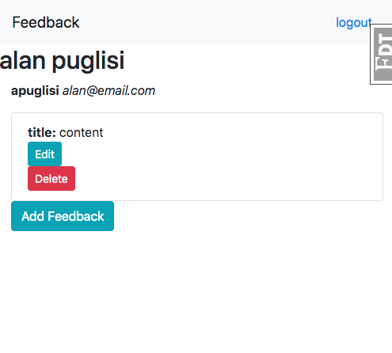
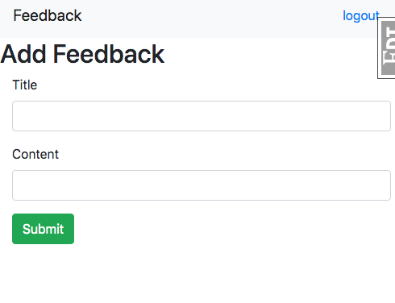

## Feedback

Feedback is an app created to practice with FlaskWTForms for Springboard.  It is a simple app that allows a registered user to submit feedback; as well as edit or delete that feedback.  

  

## Built Using
Flask - framework  
Python - backend  
FlaskWTForms - form rendering and validation  
PostgreSQL - database  
Flask SQLAlchemy - ORM for database  
BCrypt - password hashing